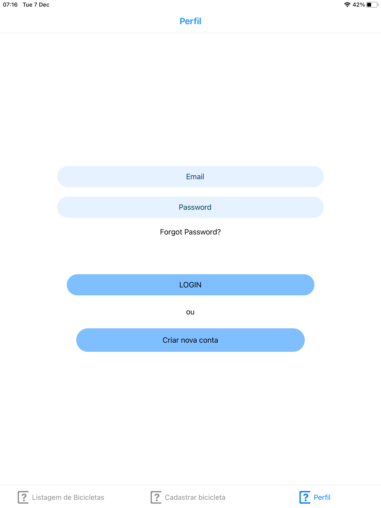
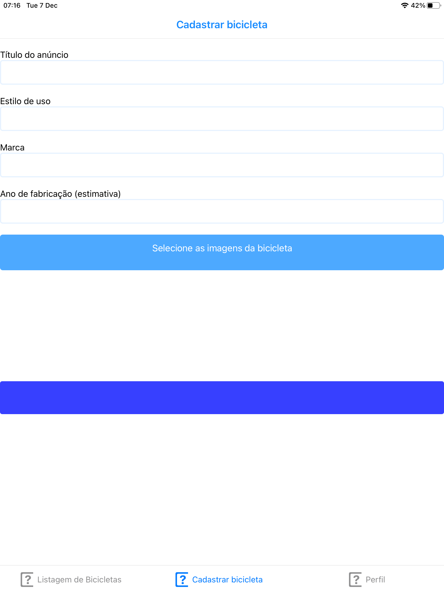
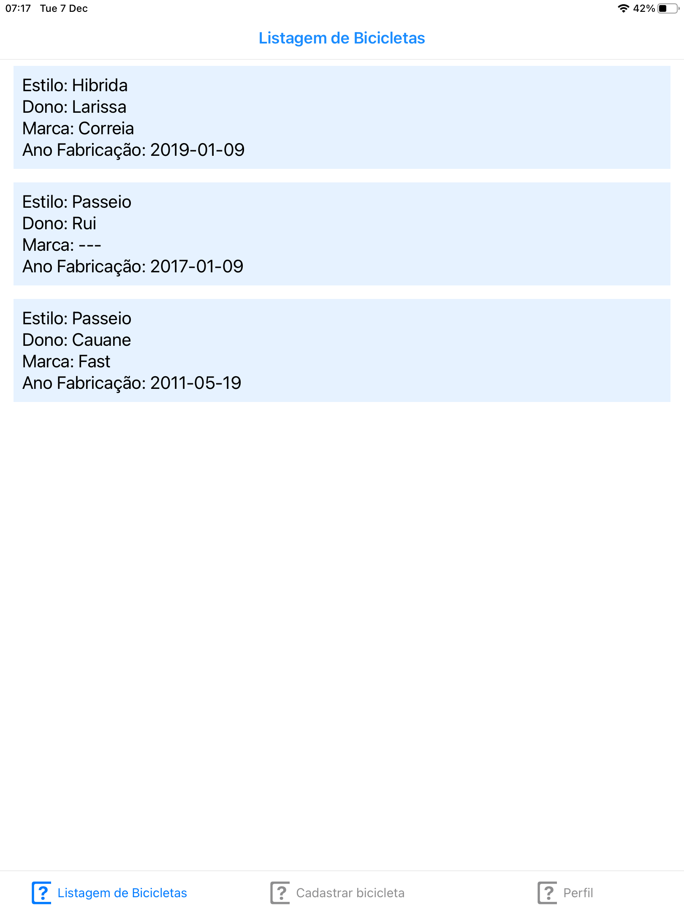
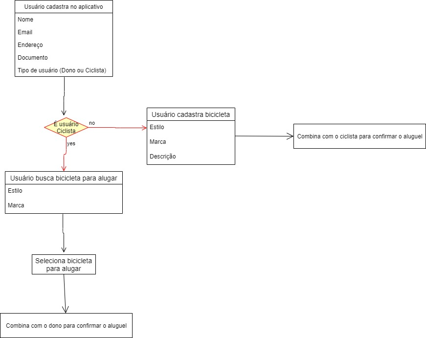
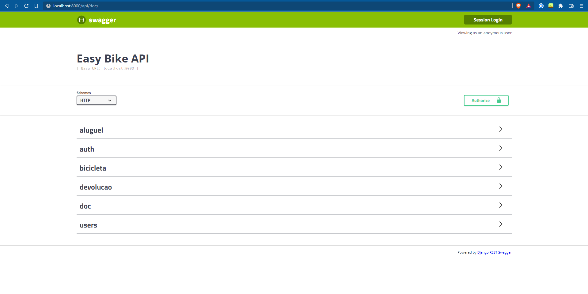
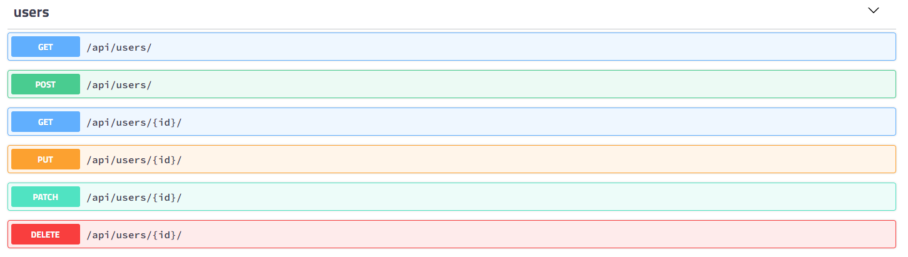
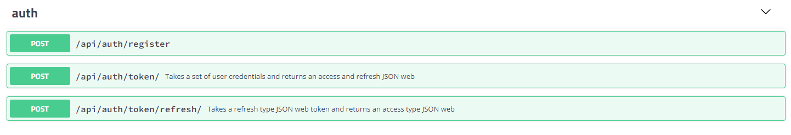
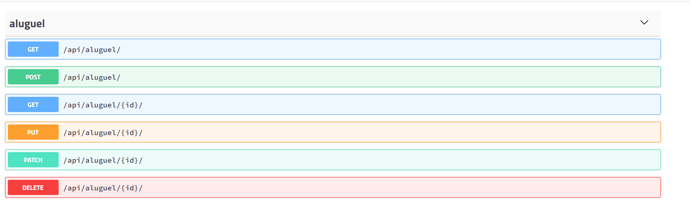
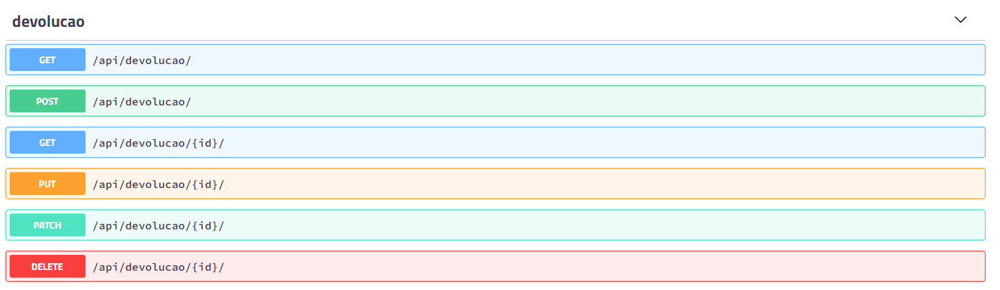

# Easy Bike 🏁

#### Aplicativo mobile para aluguel de bicicletas

##### _de pessoa física para pessoa física_

## Resultado





<details>
    <summary>Diagrama da aplicação</summary>
    
</details>

<details>
    <summary>Swagger da API</summary>
    
    
    <br/>
    
    
    <br/>
    
    
</details>

## Prazos de Entrega

- Sprint 1 (30/08 a 19/09)
- Sprint 2 (20/09 a 10/10)
- Sprint 3 (18/10 a 07/11)
- Sprint 4 (08/11 a 28/11)
- Apresentação Final (29/11 a 05/12)

## Entregas

CRUD de usuários
CRUD de bicicletas
Controle de empréstimos
controle de devolução

## Instalação de dependências, compilação e execução

Projeto iniciado utilizando Expo CLI

```
npm start
```

## Equipe

Aqui estão os integrantes da equipe e seus respectivos links do Github.

| Aluna          | Github                           |
| -------------- | -------------------------------- |
| Cauane Andrade | https://github.com/CauaneAndrade |

---

## Tecnologias

- React Native
- Django
- Docker
