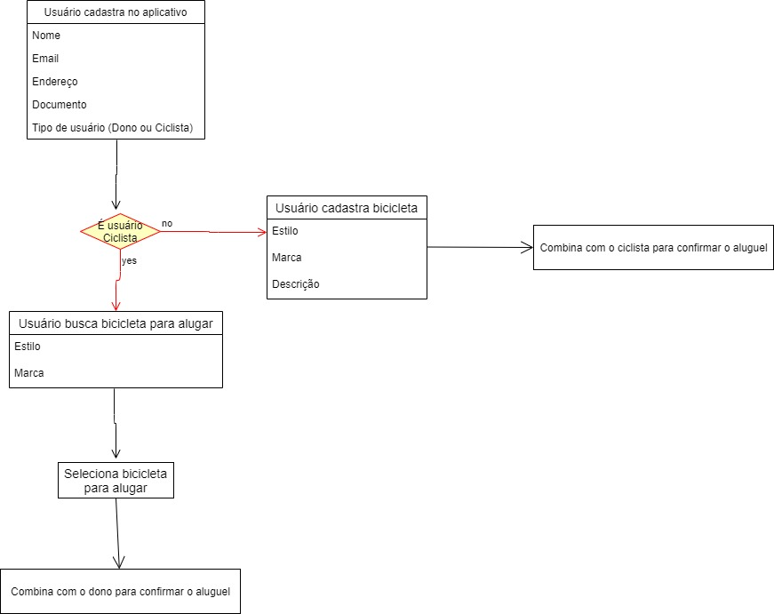

# Easy Bike 🏁
#### Aplicativo mobile para aluguel de bicicletas
##### _de pessoa física para pessoa física_



## Tecnologia
- React Native

## Prazos de Entrega
- Sprint 1 (30/08 a 19/09)
- Sprint 2 (20/09 a 10/10)
- Sprint 3 (18/10 a 07/11)
- Sprint 4 (08/11 a 28/11)
- Apresentação Final (29/11 a 05/12)

## Sprints

| Sprint 1| Sprint 2| Sprint 3| Sprint 4|
| --------------------------------------------- | ------------------------------------------------ | --------------------------------------- | ------------------------------ |
| CRUD de usuários | Ranking de relacionamento | --- | --- |
| login com Google | Integração API de GPS para controle de devolução | --- | --- |
| CRUD de bicicletas | Controle de empréstimos | --- | --- |


## Instalação de dependências, compilação e execução.
Projeto iniciado utilizando Expo CLI

```
npm start
```

## Equipe
Aqui estão os integrantes da equipe e seus respectivos links do Github.

| Aluno(a) | Github |
| ------ | ------ |
| Cauane Andrade | [Github][cauane] |
| --- | --- |

   [rafael]: <https://github.com/rafaelfmarques/>
   [caique]: <https://github.com/Caiiqef>
   [cauane]: <https://github.com/CauaneAndrade>
   [rodrigo]: <https://github.com/HideakiAndo>
   [arthur]: <https://github.com/Arthurzuk>
   [eduardo]: <https://github.com/kenjiedu>
   [jefferson]: <https://github.com/mflJefferson/>
   [springboot]: <https://spring.io/projects/spring-boot>
   [react]: <https://pt-br.reactjs.org/>
   [npm]: <https://www.npmjs.com/>
   [mysql]: <https://www.mysql.com/>
   [jpa]: <https://spring.io/projects/spring-data-jpa>
   [maven]:<https://maven.apache.org/>


---

- Firebase
- https://reactnavigation.org/docs/getting-started/